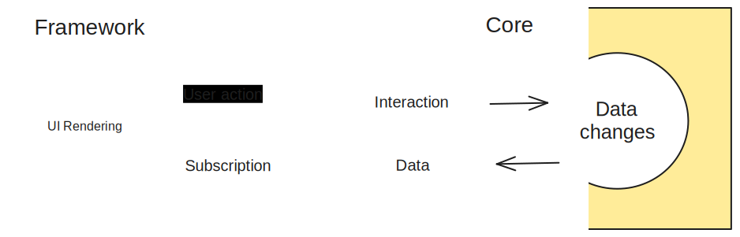

# Introduction

AgnosUI is a versatile widget library designed for various frameworks, providing a consistent user interface across platforms. Its core (also referred to as headless), written in pure TypeScript, serves as a foundation that can be utilized by any framework to generate a user interface.

You can integrate AgnosUI in two primary ways:

- Use the ready-made widgets provided for your specific framework.

This straightforward approach allows you to quickly incorporate widgets into your project. Refer to the component documentation for usage details. Currently, AgnosUI supports Angular, React, and Svelte.

- use the headless functionality to create your own customized widget.

This approach offers complete customization of widgets, including markup and styling, while benefiting from AgnosUI's headless capabilities for managing display and interactions.

This method requires a deeper understanding and more effort, detailed in the comprehensive documentation. You can start building your widget based on existing widget code.

## Motivation

Maintaining full widget libraries over time can be challenging due to framework changes, shifts in usage patterns, and projects adopting different frameworks. AgnosUI addresses this challenge by separating the state and behavior of a widget from its rendering engine (the frameworks). This separation brings stability and several benefits:

- Core functionalities are managed in pure TypeScript, avoiding issues tied to UI frameworks' constraints.
- The main code stays the same even if the framework changes.
- Fixes or new features seamlessly apply to all supported frameworks.
- Unit tests are straightforward, focusing on the core written in pure Typescript for enduring reliability.
- UI Frameworks are used only rendering the UI based on the widget state.
- Consistency is maintained across frameworks, ensuring uniformity for organizations using different frameworks.

## How does it work ?

The basic idea is to manage a widget from a data point of view only and APIs to interact with these data. This is a global picture:

The fundamental concept of AgnosUI revolves around managing a widget purely from a data perspective, along with APIs to interact with this data. The high-level workflow is illustrated below:

AgnosUI constructs widgets based on data, independent of the rendering engine in use. To be framework-agnostic, the system must provide:

- All necessary data for the UI.
- APIs to modify this data.
- A reactive system to notify the rendering engine of data changes, enabling synchronized UI updates.

## Reactivity with Tansu

The reactivity in AgnosUI is managed with [Tansu](https://github.com/AmadeusITGroup/tansu).

Tansu has been initially developed by following the Svelte store specifications. It then extends its features to achieve full store management capabilities:

- Supports all [Svelte stores specifications](https://svelte.dev/docs/svelte-store),
- The `Signal` capabilities have been added. Notably, `computed` is available in addition to `derived`. The store itself is a function that can be invoked to obtain the current value.
- A `batch` method is provided to mitigate glitch issues.
- Synchronous subscriber calls are ensured to prevent unpredictable issues when integrating with other frameworks.

Tansu is the chosen solution due to its comprehensive feature set, making it the best fit for AgnosUI.

In this project, a Tansu object is typically referred to as a `store`, and corresponding variables are postfixes with a `$` sign.

## Integration in frameworks

Currently, AgnosUI provides UI adapters for three frameworks: Angular, React, and Svelte.

Using them is straightforward, just like any other external library. Import a widget and use it in your project. Refer to the specific documentation for each framework to understand the implementation details.

To make the most of AgnosUI, familiarize yourself with the following concepts:

- AgnosUI comes with a comprehensive configuration system. Each prop of every widget has a default value that can be overridden at any level of the component subtree. For more details, check out the [configuration section](../01-Headless/01-Configuration.md).

- Slots provide a means to customize your widget through content projection. Learn more in [this section](../01-Headless/02-Slots.md).

- Certain utilities are designed to be used as or with a directive. Directives are simple functions that can be applied to a DOM element. Learn more about this topic in [this section](../01-Headless/03-Directives.md).

## Headless

As AgnosUI widgets are built on a reactive data system, you can leverage the core to create your own markup, using the data and the API to manage the UI and its behavior.

Learn more about this in the [headless section](../01-Headless/00-Introduction.md)
